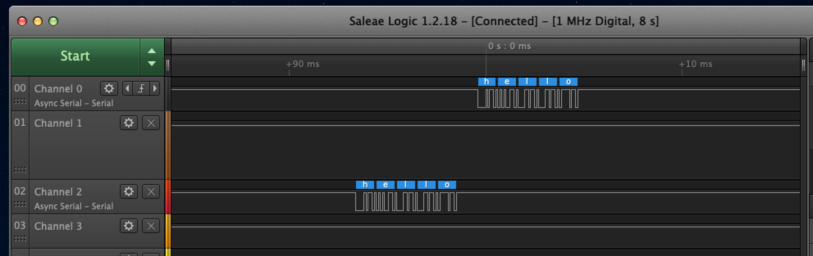

Name: Alexander Ali

EID: aca2948

Team Number: F3

## Questions

1. Why does your program need a setup and a loop?

    Setup: To enable certain pins and set them to input or output, initialize board
    Loop: Continuously run the program that was coded

2. What is the downside to putting all your code in a loop?

    It is redundant to continuously initialize pins and it is less organized

3. Why does your code need to be compiled?

    So a file is created in machine language that the computer can read

4. When lowering the frequency in procedure A, step 4, what is going wrong? Brainstorm some solutions. Dimmers exist in the real world. What is their solution?

   It flickers visibly as it brightens and dims
   Solutions: use a higher frequency so the human eye cannot detect the flickering and do not lower the frequency below a certain threshold
   Real world solution: 

5. Why do you need to connect the logic analyzer ground to the ESP32 ground?

    So the voltages are relative to the same ground value
    *not sure*

6. What is the difference between synchronous and asynchronous communication?

    your answer here

7. Profile of UART: Sent X bytes in Y time

    sent 5 bytes in 5.262 ms

8. Profile of SPI: Sent X bytes in Y time

    sent 2 bytes in 36 microseconds

9. Why is SPI so much faster than UART?

    your answer here

10. list one pro and one con of UART

    your answer here

11. list one pro and one con of SPI

    your answer here

12. list one pro and one con of I2C

    your answer here

13. Why does I2C need external resistors to work?

    your answer here

## Screenshots

Procedure A, step 1:

Procedure A, step 4:

Procedure B, UART:

Procedure B, SPI:

